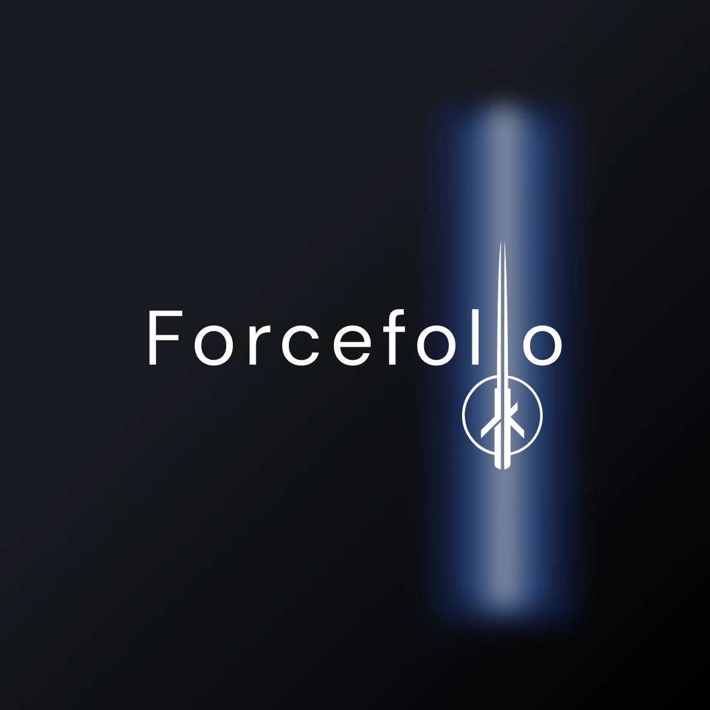

  

# The Force

Esse é meu portifólio pessoal

## Overview

Este projeto foi gerado usando [Angular CLI](https://github.com/angular/angular-cli) version 12.2.18.  
E [NodeJS](https://github.com/nodejs) version 14.15.0 - npm 6.14.8

O intuito do projeto é funcionar como portifólio pessoal, para exibir as minhas principais habilidades e projetos relacionados a desenvolvimento de softwares.

## Pré Requisitos
[Angular CLI](https://github.com/angular/angular-cli) version 12.2.18  
[NodeJS](https://github.com/nodejs) version 14.15.0 - npm 6.14.8

## Desenvolvimento local

Use o script `npm start` para rodar o projeto localmente. Navegue para `http://localhost:4200/`.

## Rodando os testes unitários

Use o script `npm run test:prod` para executar os testes unitarios via [Karma](https://karma-runner.github.io).
